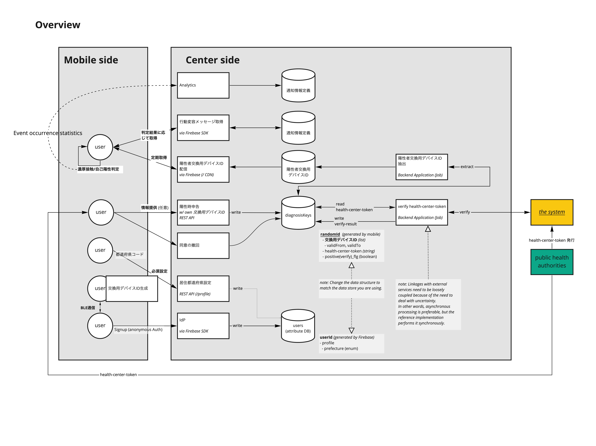

# mamori-i-japan-api

[](https://circleci.com/gh/mamori-i-japan/mamori-i-japan-api)
[](https://github.com/mamori-i-japan/mamori-i-japan-api/releases)
[](./LICENSE)

REST API Server for Japanese Exposure Notification App to fight against COVID-19 a.k.a. \"まもりあいJAPAN\".

## Architecture

### Overview and Data Flow Diagram




The images made by [Miro](https://miro.com/app/board/o9J_ksGHtPE=/) (read only access).

## Technology Stack

### Application

- Runtime Environment: [Node.js 12.16.2](https://nodejs.org/)
- Package Manager: [npm 6.14.4](https://www.npmjs.com/)
- Programming Language Processor: [TypeScript 3.8.3](https://www.typescriptlang.org/)
- Web Application Framework: [Nest 7.0.7](https://nestjs.com/)

### Hosting

#### Amazon Web Services

- Amazon Route 53
- Amazon API Gateway
- AWS Lambda
- AWS Systems Manager
- [Serverless Framework](https://serverless.com/) (to manage and deploy)

#### Firebase

- Firebase Authentication
- Cloud Firestore
- Cloud Storage

## Getting Started

### Installation

```sh
npm install
```

### Running the Application on Local

Make sure you add the env vars in `.env` file. Just copy the `.env.template` file.

And then execute:

```sh
# development mode
npm run start

# watch mode
npm run start:dev

# serverless offline mode
npm run sls-offline

# production mode
npm run start:prod
```

### Testing

```sh
# unit tests
npm run test

# end-to-end tests
npm run test:e2e

# get the test coverage
npm run test:cov
```

### Deployment

```sh
# deploy to DEV environment
npm run deploy:dev
```

## Development

### Project Layout (Brief Explaination)

```
.
├── .env (Make sure to create this file locally and fill the env vars)
├── src
│   ├── main.ts (This entry point is used for local server)
│   ├── lambda-main.ts (This entry point is used for lambda server)
│   ├── auth (module)
│   │   ├── guards
│   │   └── strategies (Implementation of Firebase Auth access token check)
│   └── users (module)
│       ├── users.service.ts (Services can call other services and their own repository)
│       └── user.repository.ts (Repositroy should be called only by its parent service)

```

As mentioned briefly in the project layout for `users`, to keep layout clean, we follow this convention:

1. **Controllers**: HTTP routes map to handler functions in controllers.
1. **Services**: Controllers call their service function.  
    A) A `user controller` must call only a `user service`, and not any other service if it can be avoided.  
    B) A `user service` can call other services like `cats service`, etc.  
    C) A `user service` must call only a `user repository`, and not any other repository if it can be avoided. If a `user service` wants to modify data in `cats repository`, it must call corresponding `cats service` funtion to do it.
1. **Repositories**: Repositories have data layer implementation, ex: `Firestore` in this project. They must be called only by their direct parent service, ex: A `user repository` is called by a `user service`.

## Testing report

- [Load Testing](https://docs.google.com/spreadsheets/d/1qiYa7g6ridHUalt3PVmS8lluR9VV3Y5EkMeMFpvx2AI/edit?usp=sharing)
- [Internal Penetration Testing](https://docs.google.com/document/d/1OfCHe0gPAP1MTm5kr68lDkvBgg1JImvt7TguHLq5NUs/edit?usp=sharing)

## Contact

- [Contact Form](https://docs.google.com/forms/d/e/1FAIpQLSfcGM9itQ3i--GN9FUsQpdlW58Ug4Y6lcnE11N-igILDJdZlw/viewform)

## Contributors

- [Yash Murty](https://github.com/yashmurty)
- [Shogo Mitomo](https://github.com/shogo-mitomo)
- [Daisuke Hirata](https://github.com/DaisukeHirata)
